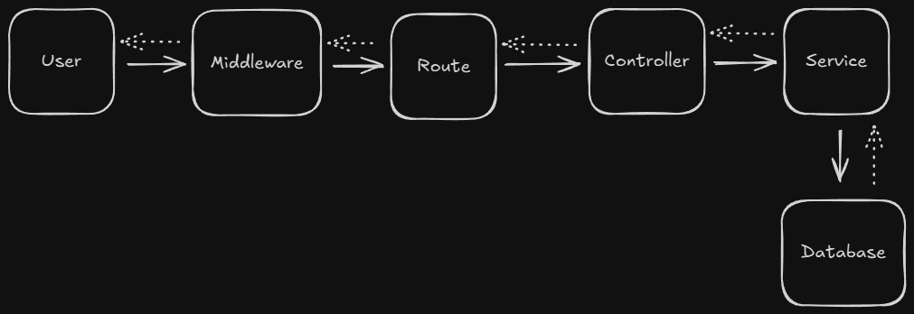
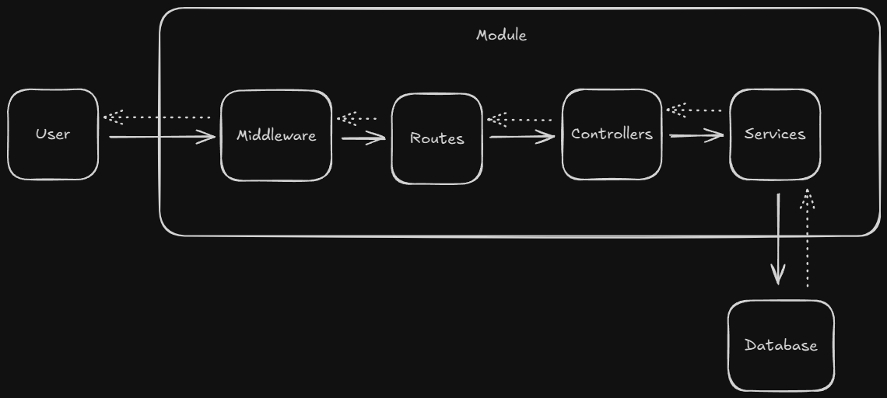

# NestJs
* NestJs is a framework (_not a library, like ExpressJs_)
* Uses **ExpressJs' server behind the scene**, like; its build on top of ExpressJs - to do all the manual things we need to do in ExpressJs 

    > TLDR: NestJs' default web server is ExpressJs

* **NOTE**: _We can change the server to `Fastify` also_

* In ExpressJs, General flow of control when one calls an API, -

    

* In NestJs, General flow of control is same as ExpressJs, but all the business logic related to a specific Object, is encapsulated in a `module`, as - 

    

### Modules

* NestJs provides a basic Root Module, (__App Module__), through which all the requests are served
* **IMPORTANT**: Say, If we need to create some business logic related to "Users" and "Courses", then we need to create separate modules for both, "Users" and "Courses" and register them in the `App/Root Module`

### Controllers

* Handle the **request and response**
* Needed when creating Api endpoints

### Services

* **Business Logic** goes in the Services
